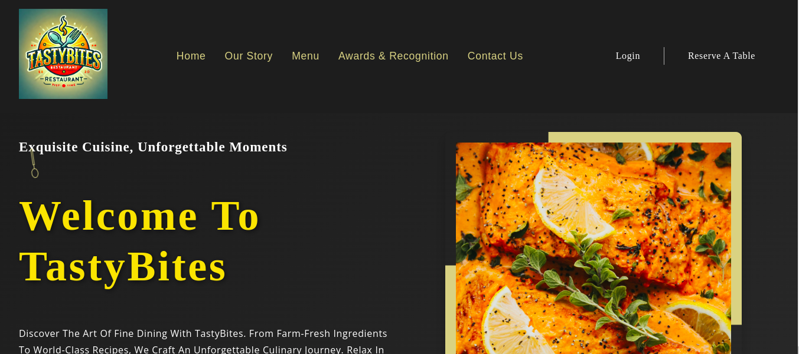

# TastyBites Restaurant 🍴

- TastyBites Restaurant is a modern web app designed to showcase a restaurant's menu, highlight special offers, and enhance the dining experience. Built with React, it provides an intuitive platform for browsing dishes, reserving tables, and learning more about the restaurant.

## TastyBites Features:
1. **Interactive Menu:** Browse an extensive menu categorized by cuisine and meal types.
2. **Table Reservations:** Seamlessly book tables for specific dates and times.
3. **Special Offers:** Stay updated on discounts and limited-time promotions.
4. **Restaurant Overview:** Learn about TastyBites' story, vision, and location details.
5. **Responsive Design:** Delivers an optimal experience on mobile, tablet, and desktop devices.

## Technology Stack:
### Frontend:
- **React:** Component-based framework for building dynamic UIs.
- **CSS3:** Styling to create a visually appealing design.
- **JavaScript (ES6):** Adds interactivity and functionality.
### Backend:
- **JSON Server:** Simulates a REST API to handle static data such as menu items and reservations.

 ## API Integration:
- **External APIs:** Fetch real-time data for reservations or additional restaurant services.

 ## Deployment:
- **Netlify:** For hosting and deployment, ensuring fast and reliable access.

